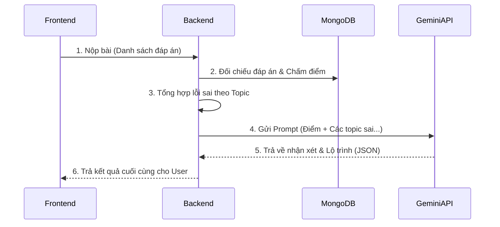

# 📋 ScoreUp AI Learning Advisor (MVP)

> **Dự án**: ScoreUp — Nền tảng thi trắc nghiệm có AI phân tích điểm yếu và gợi ý lộ trình học.
> **Quy mô**: Mini-project sinh viên (Phiên bản Tối giản - MVP)
> **Tech stack**: React (Frontend) · Node.js + Express (Backend) · MongoDB · Gemini API (AI)

---

## 🎯 Mục tiêu cốt lõi (MVP)
Phiên bản này tập trung giải quyết đúng 1 bài toán: **Người dùng làm bài thi ➡️ Hệ thống tổng hợp lỗi sai theo chủ đề ➡️ AI đưa ra lời khuyên cá nhân hóa.**

Các tính năng rườm rà (Quản lý CRUD câu hỏi, tự động phân tích độ khó...) tạm thời được cắt bỏ để tập trung vào luồng chính.

---

## 👥 Vai trò & Tính năng

### 1. Admin (Người quản trị dữ liệu)
- **Không yêu cầu giao diện (No UI needed)**: Admin tương tác trực tiếp với Database/File cấu hình.
- **Data Tagging (Gắn thẻ tri thức)**: Chuẩn bị ngân hàng câu hỏi. Trách nhiệm của Admin là đảm bảo mỗi câu hỏi đều được gán đúng `topic` (chủ đề kiến thức) và `difficulty` (độ khó). 
  *(Ví dụ: Câu 1 - Topic: "Vòng lặp For", Câu 2 - Topic: "Biến trong JS").*

### 2. User (Người học)
- **Làm bài thi**: Chọn môn học và trả lời các câu hỏi trắc nghiệm.
- **Nhận kết quả & AI Phân tích**: Sau khi bấm nộp bài, User sẽ thấy:
  - Tổng điểm và chi tiết câu Đúng/Sai.
  - **Nhận xét từ AI**: Chỉ ra chính xác User đang hổng kiến thức ở "Topic" nào (dựa trên Data Tagging của Admin).
  - **Lộ trình học tập**: AI gợi ý các bước ôn tập tiếp theo.

---

## ⚙️ Luồng hoạt động hệ thống



---

## 🛠 Phân chia Đầu việc (4 Thành viên)

### 👤 TV1 — Frontend (Giao diện)
- Xây dựng giao diện thi trắc nghiệm (chọn đáp án).
- Đóng gói dữ liệu bài thi (ID câu hỏi, đáp án đã chọn) gửi lên API `POST /api/submit`.
- Xây dựng UI hiển thị điểm số và render kết quả Lời khuyên/Lộ trình do AI trả về.

### 👤 TV2 — Backend Core (Kiến trúc MCS)
- Dựng server Node.js theo kiến trúc Modular (Auth, Users, Questions, AI).
- Viết API `GET /api/questions` để gửi danh sách câu hỏi cho Frontend.
- Viết API `POST /api/submit`: Nhận bài làm, đối chiếu đáp án, tính điểm, lưu lịch sử bài làm vào MongoDB.
- Phối hợp với TV3 để gọi module AI sau khi chấm điểm xong.

### 👤 TV3 — AI Integration (Tích hợp AI)
- Viết module kết nối với Google Gemini API.
- **Prompt Engineering**: Thiết kế Prompt động để nhét dữ liệu bài làm (Ví dụ: *"User này thi được 4/10 điểm, sai nhiều nhất ở topic 'Vòng lặp'..."*).
- Ép AI trả về đúng format (JSON) để Frontend dễ dàng vẽ UI.

### 👤 TV4 — Data & Testing (Dữ liệu)
- **Data Tagging**: Soạn thảo bộ câu hỏi mẫu (file JSON hoặc DB init). Gắn tag (Topic) chuẩn xác cho từng câu hỏi.
- Thiết lập MongoDB Atlas (Cloud) và chia sẻ URI cho cả nhóm.
- Đóng vai trò QA/Tester: Chạy thử luồng từ lúc thi đến lúc AI trả kết quả để đảm bảo không gãy luồng.

---

## 📂 Cấu trúc Backend hiện tại
Dự án sử dụng kiến trúc MCS (Module - Controller - Service):
```text
src/
 ├── core/          # Cấu hình Database, Utilities
 ├── modules/       # Chứa logic nghiệp vụ chia theo tính năng
 │    ├── auth/
 │    ├── users/
 │    ├── questions/
 │    └── ai/       # Nơi TV3 làm việc
 └── routes/        # Nơi đăng ký đường dẫn API
```

---

## 🖼 Cấu trúc Frontend (React)

```text
frontend/src/
 ├── components/    # Các UI Component dùng chung (Button, Modal, Loading...)
 ├── pages/         # Các màn hình chính (Home, QuizView, ResultView)
 ├── services/      # Các hàm fetch/axios để gọi API tới Backend
 ├── utils/         # Các hàm tiện ích (Format ngày giờ, tính toán thời gian...)
 └── App.jsx        # Nơi khai báo các Route (Đường dẫn trang)
```
